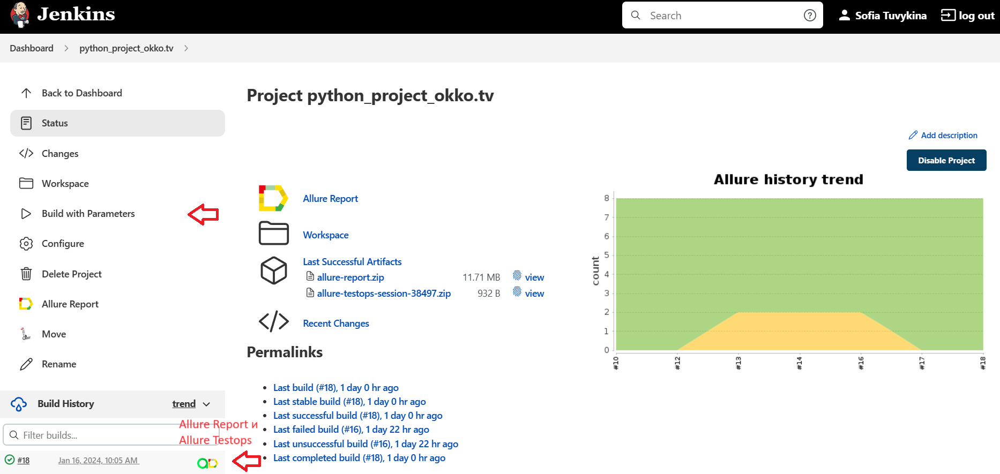
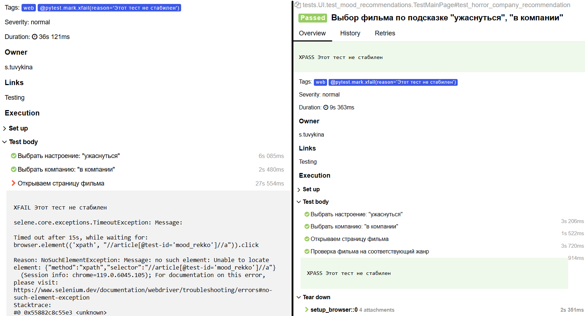

## Проект UI автотестов на онлайн-кинотеатр okko.tv


<h3> Список реализованных проверок:</h3>

* Поиск фильма по поисковой строке 
* Выбор фильма по подсказке и проверка на соответствующий жанр 
* Выбор фильма по категории и проверка на соответствующий жанр
  
----
### Используется:
<p  align="center">
  <code></code>
  <code></code>
  <code></code>
  <code></code>
  <code></code>
  <code></code>
  <code></code>
  <code></code>
  <code></code>
</p>

----
### Локальный запуск

> Для локального запуска необходимо выполнить команду в СLI:
```bash
python -m venv .venv
source .venv/bin/activate
pip install -r requirements.txt
pytest tests/
```

> Получение Allure отчета
```bash
allure serve allure-results/
```

----
###  Запуск проекта в Jenkins

### [Jenkins](https://jenkins.autotests.cloud/job/python_project_okko.tv/)

##### При нажатии на "Build with Parameters" начнется сборка тестов и их прохождение, через виртуальную машину в Selenide


<!-- Allure report -->

###  Allure report
### [Report](https://jenkins.autotests.cloud/job/python_project_okko.tv/18/allure/)
##### Результаты тестов в Allure отчете


##### Список тест кейсов


##### Пример отчета о прохождении ui-теста


##### Видео прохождение теста


##### Видео и отчет о прохождении теcта с багом на сайта



